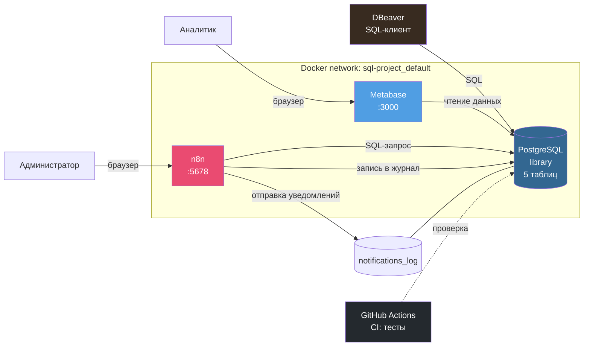

# Библиотека под контролем

[](https://github.com/Puzz1eAssemb1er/library-analytics/actions/workflows/tests.yml)

Учебный проект, демонстрирующий полный цикл работы с данными: от проектирования базы данных до аналитики, моделирования процессов и автоматизации.

## О проекте

На примере предметной области «Библиотека» показано, как из разрозненных данных получить работающую систему поддержки принятия решений. Проект охватывает три ключевых направления:

- **Работа с данными** — проектирование реляционной базы данных, написание аналитических SQL-запросов
- **Визуализация и BI** — построение дашбордов с ключевыми метриками библиотеки
- **Автоматизация процессов** — сценарии, которые срабатывают без участия человека

## Стек технологий

| Область | Инструмент | Роль в проекте |
|---|---|---|
| СУБД | PostgreSQL 16 | Хранилище данных |
| SQL-клиент | DBeaver | Написание запросов, администрирование |
| BI | Metabase | Дашборды, визуализация |
| BPMN | bpmn.io | Моделирование бизнес-процессов |
| Автоматизация | n8n | Оркестрация, сценарии |
| Контейнеризация | Docker Desktop | Развёртывание всех сервисов |

## Архитектура



## Структура проекта

project/
├── .github/
│   └── workflows/
│       └── tests.yml          # GitHub Actions: автозапуск тестов
├── bpmn/
│   ├── issue-book.bpmn        # Схема процесса «Выдача книги»
│   ├── issue-book.svg
│   ├── debt-process.bpmn      # Схема процесса «Работа с задолженностями»
│   └── debt-process.svg
├── screenshots/
│   ├── dashboard-metabase.png # Дашборд Metabase
│   ├── workflow-n8n.png       # Workflow в n8n
│   └── bpmn-debt.png          # Схема BPMN
├── sql/
│   ├── schema.sql             # Схема базы данных
│   ├── seed-data.sql          # Базовые тестовые данные
│   ├── generate-data.sql      # Генератор расширенного набора (100+ читателей, 500+ выдач)
│   └── analytics.sql          # Аналитические запросы (7 отчётов)
├── tests/
│   ├── run-tests.ps1          # Скрипт запуска тестов
│   ├── test_integrity.sql     # Тесты целостности данных
│   └── test_business_logic.sql # Тесты бизнес-логики
└── README.md


## Модель данных

База данных состоит из шести связанных таблиц:

- **authors** — авторы книг
- **books** — книги (связаны с авторами)
- **readers** — читатели библиотеки
- **loans** — выдачи книг (связывают читателей и книги)
- **notifications_log** — журнал отправленных уведомлений
- **error_log** — журнал ошибок workflow в n8n

Объём данных в учебной базе: более 100 читателей, 500 выдач за последние 4 месяца. Такой набор позволяет строить осмысленную RFM-сегментацию, анализировать распределение просрочек и проверять аналитические запросы на реалистичных объёмах.

## Аналитика

В Metabase построены семь отчётов:

1. **Топ авторов по количеству книг** — кто из авторов представлен наиболее широко
2. **Популярность книг** — рейтинг по количеству выдач
3. **Просроченные выдачи** — список невозвращённых книг с указанием дней просрочки
4. **RFM-сегментация читателей** — разделение читателей на группы по давности последней выдачи
5. **Прогноз задолженностей по книгам** — средний срок возврата и процент просрочек по каждой книге
6. **Ранжирование читателей в сегментах** — топ читателей в каждой RFM-группе (оконная функция `RANK() OVER`)
7. **Динамика выдач по неделям** — недельный тренд с накопительным итогом и скользящим средним (оконные функции `SUM() OVER`, `AVG() OVER`)

Все отчёты собраны на одном дашборде **«Библиотека: аналитика»**.


## Автоматизация

В n8n реализован workflow **«Ежедневная проверка задолженностей»**:

1. Запускается по расписанию (раз в сутки в полночь)
2. Выполняет SQL-запрос к PostgreSQL, находя просроченные выдачи
3. Записывает каждую просрочку в таблицу `notifications_log` с текстом уведомления

**Обработка ошибок.** Workflow имеет две ветки выполнения:

- **Success** — если SQL-запрос выполнился, информация о просрочках пишется в `notifications_log`
- **Error** — если запрос упал (например, БД недоступна), текст ошибки сохраняется в таблицу `error_log`

Для узла «Найти просроченные выдачи» включён режим `Retry On Fail` (3 попытки с паузой 1 секунда). Это защищает от временных сбоев сети.

Workflow опубликован и работает в автоматическом режиме.


## Развёртывание

Все сервисы работают в Docker. Для запуска проекта необходимы:

- Docker Desktop
- PostgreSQL (контейнер `sql_postgres`)
- Metabase (контейнер `metabase_app`)
- n8n (контейнер `n8n_app`)

### Порядок запуска

1. PostgreSQL: `docker compose up -d` в папке `Z:\sql-project`
2. Metabase: `docker compose up -d` в папке `Z:\metabase`
3. n8n: `docker compose up -d` в папке `Z:\n8n`

### Доступ к сервисам

| Сервис | Адрес | Учётные данные |
|---|---|---|
| PostgreSQL | localhost:5432 | admin / admin123 |
| Metabase | http://localhost:3000 | admin@example.com / Admin123! |
| n8n | http://localhost:5678 | admin@example.com / Admin123! |

## Тестирование

В проекте реализованы SQL-тесты двух типов:

- **Тесты целостности данных** (`tests/test_integrity.sql`) — проверяют, что в базе нет «осиротевших» записей, даты корректны, а email уникальны
- **Тесты бизнес-логики** (`tests/test_business_logic.sql`) — проверяют, что аналитические запросы возвращают ожидаемые результаты: RFM-сегментация покрывает всех читателей, расчёт просрочки не даёт отрицательных значений, отчёты включают все записи

Запуск всех тестов одной командой:

```powershell
powershell -ExecutionPolicy Bypass -File tests\run-tests.ps1

## Навыки, продемонстрированные в проекте

- Проектирование реляционных баз данных с нормализацией и связями
- Написание SQL-запросов: JOIN, LEFT JOIN, GROUP BY, агрегатные функции, работа с датами
- Создание индексов и оптимизация запросов
- Построение аналитических дашбордов в BI-инструменте
- Моделирование бизнес-процессов в нотации BPMN 2.0
- Автоматизация процессов с интеграцией БД и оркестрацией
- Развёртывание сервисов через Docker Compose
