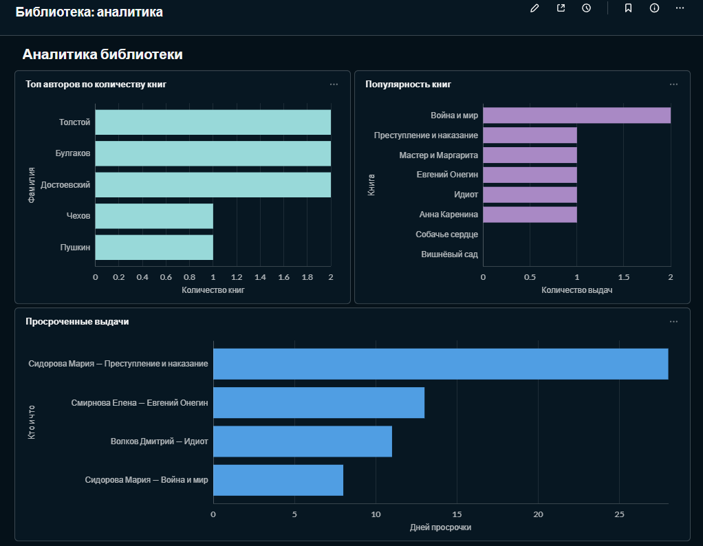
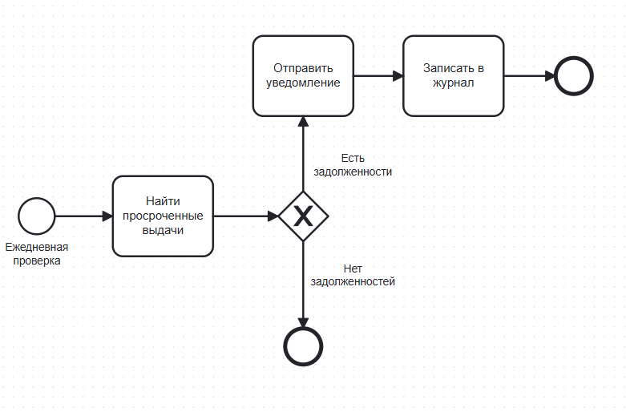
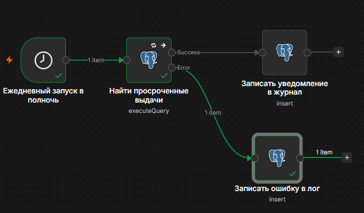

# Библиотека под контролем

[](https://github.com/Puzz1eAssemb1er/library-analytics/actions/workflows/tests.yml)

Учебный проект, демонстрирующий полный цикл работы с данными: от проектирования базы данных до аналитики, моделирования процессов и автоматизации.

## О проекте

На примере предметной области «Библиотека» показано, как из разрозненных данных получить работающую систему поддержки принятия решений. Проект охватывает три ключевых направления:

- **Работа с данными** — проектирование реляционной базы данных, написание аналитических SQL-запросов
- **Визуализация и BI** — построение дашбордов с ключевыми метриками библиотеки
- **Автоматизация процессов** — сценарии, которые срабатывают без участия человека

## Стек технологий

| Область | Инструмент | Роль в проекте |
|---|---|---|
| СУБД | PostgreSQL 16 | Хранилище данных |
| Миграции | Flyway | Версионирование схемы БД |
| SQL-клиент | DBeaver | Написание запросов, администрирование |
| BI | Metabase | Дашборды, визуализация |
| BPMN | bpmn.io | Моделирование бизнес-процессов |
| Автоматизация | n8n | Оркестрация, сценарии |
| Контейнеризация | Docker Desktop | Развёртывание всех сервисов |
| CI | GitHub Actions | Автозапуск тестов |
## Архитектура

```mermaid
flowchart LR
    subgraph Docker["Docker network"]
        PG[(PostgreSQL library)]
        MB[Metabase :3000]
        N8N[n8n :5678]
        FW[Flyway migrations]
    end
    DBEAVER[DBeaver] -->|SQL| PG
    MB -->|read| PG
    N8N -->|SQL| PG
    FW -->|migrations| PG
    GH[GitHub Actions CI] -.->|tests| PG
    style PG fill:#336791,color:#fff
    style MB fill:#509EE3,color:#fff
    style N8N fill:#EA4B71,color:#fff
    style FW fill:#CC0200,color:#fff
## Структура проекта

    project/
    ├── .github/workflows/tests.yml
    ├── bpmn/
    │   ├── issue-book.bpmn
    │   ├── debt-process.bpmn
    │   └── debt-process.svg
    ├── migrations/
    │   ├── V1__create_tables.sql
    │   ├── V2__add_indexes.sql
    │   └── V3__add_logs.sql
    ├── screenshots/
    │   ├── dashboard-metabase.png
    │   ├── workflow-n8n.png
    │   └── bpmn-debt.png
    ├── sql/
    │   ├── schema.sql
    │   ├── seed-data.sql
    │   ├── generate-data.sql
    │   └── analytics.sql
    ├── tests/
    │   ├── run-tests.ps1
    │   ├── test_integrity.sql
    │   └── test_business_logic.sql
    ├── docker-compose.flyway.yml
    └── README.md

## Модель данных

База данных состоит из шести связанных таблиц:

- **authors** — авторы книг
- **books** — книги (связаны с авторами)
- **readers** — читатели библиотеки
- **loans** — выдачи книг (связывают читателей и книги)
- **notifications_log** — журнал отправленных уведомлений
- **error_log** — журнал ошибок workflow в n8n

Объём данных в учебной базе: более 100 читателей, 500 выдач за последние 4 месяца.

## Аналитика

В Metabase построены семь отчётов:

1. **Топ авторов по количеству книг** — кто из авторов представлен наиболее широко
2. **Популярность книг** — рейтинг по количеству выдач
3. **Просроченные выдачи** — список невозвращённых книг с указанием дней просрочки
4. **RFM-сегментация читателей** — разделение читателей на группы по давности последней выдачи
5. **Прогноз задолженностей по книгам** — средний срок возврата и процент просрочек по каждой книге
6. **Ранжирование читателей в сегментах** — топ читателей в каждой RFM-группе (оконная функция RANK() OVER)
7. **Динамика выдач по неделям** — недельный тренд с накопительным итогом и скользящим средним (оконные функции SUM() OVER, AVG() OVER)

Все отчёты собраны на одном дашборде **«Библиотека: аналитика»**.


## Бизнес-процессы (BPMN)

Смоделированы два процесса:

1. **Выдача книги** — от запроса читателя до выдачи или отказа
2. **Работа с задолженностями** — ежедневная проверка просрочек, отправка уведомлений, запись в журнал



## Автоматизация

В n8n реализован workflow **«Ежедневная проверка задолженностей»**:

1. Запускается по расписанию (раз в сутки в полночь)
2. Выполняет SQL-запрос к PostgreSQL, находя просроченные выдачи
3. Записывает каждую просрочку в таблицу notifications_log с текстом уведомления

**Обработка ошибок.** Workflow имеет две ветки выполнения:

- **Success** — если SQL-запрос выполнился, информация о просрочках пишется в notifications_log
- **Error** — если запрос упал, текст ошибки сохраняется в таблицу error_log

Для узла «Найти просроченные выдачи» включён режим Retry On Fail (3 попытки с паузой 1 секунда).



## Развёртывание

Все сервисы работают в Docker:

- Docker Desktop
- PostgreSQL (контейнер sql_postgres)
- Metabase (контейнер metabase_app)
- n8n (контейнер n8n_app)

### Управление схемой БД

Схема базы данных управляется через Flyway. Все изменения структуры оформляются отдельными миграциями в папке migrations/:

- V1__create_tables.sql — базовые таблицы
- V2__add_indexes.sql — индексы для внешних ключей
- V3__add_logs.sql — таблицы логирования

Применить миграции:

    docker compose -f docker-compose.flyway.yml up

### Порядок запуска

1. PostgreSQL: docker compose up -d в папке Z:\sql-project
2. Миграции: docker compose -f docker-compose.flyway.yml up в папке Z:\project
3. Metabase: docker compose up -d в папке Z:\metabase
4. n8n: docker compose up -d в папке Z:\n8n

### Доступ к сервисам

| Сервис | Адрес | Учётные данные |
|---|---|---|
| PostgreSQL | localhost:5432 | admin / admin123 |
| Metabase | http://localhost:3000 | admin@example.com / Admin123! |
| n8n | http://localhost:5678 | admin@example.com / Admin123! |

## Тестирование

В проекте реализованы SQL-тесты двух типов:

- **Тесты целостности данных** (tests/test_integrity.sql) — проверяют, что в базе нет «осиротевших» записей, даты корректны, а email уникальны
- **Тесты бизнес-логики** (tests/test_business_logic.sql) — проверяют, что аналитические запросы возвращают ожидаемые результаты

Запуск всех тестов одной командой:

    powershell -ExecutionPolicy Bypass -File tests\run-tests.ps1

### Покрытие

| Файл | Тестов | Что проверяет |
|---|---|---|
| test_integrity.sql | 4 | Целостность связей, даты, уникальность email |
| test_business_logic.sql | 5 | RFM-сегментация, просрочки, полнота отчётов |

Все 9 тестов проходят успешно.

## Навыки, продемонстрированные в проекте

- Проектирование реляционных баз данных с нормализацией и связями
- Управление схемой БД через миграции (Flyway)
- Написание SQL-запросов: JOIN, LEFT JOIN, GROUP BY, оконные функции, агрегация, работа с датами
- Создание индексов и оптимизация запросов
- Построение аналитических дашбордов в BI-инструменте
- Моделирование бизнес-процессов в нотации BPMN 2.0
- Автоматизация процессов с интеграцией БД и обработкой ошибок
- Развёртывание сервисов через Docker Compose
- Написание SQL-тестов и настройка CI через GitHub Actions